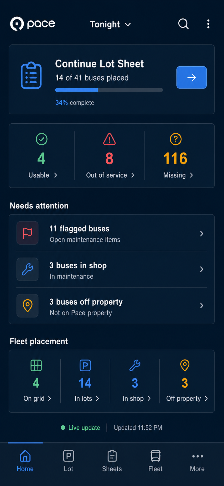
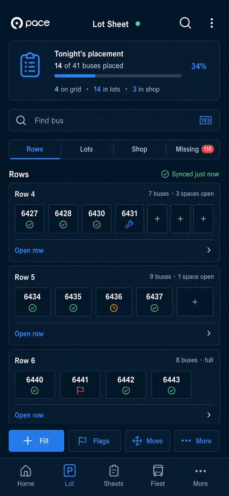
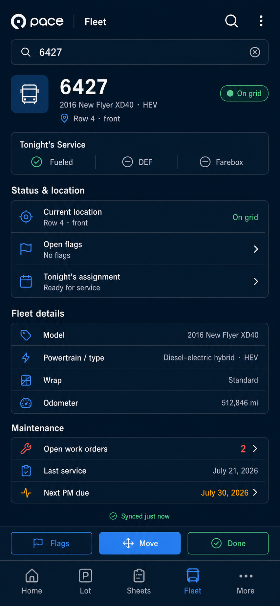

# Cohesive Mobile System

This set combines:

- the detailed operational information from the first concept;
- the resumable Lot Sheet workflow and fleet totals from the second concept;
- the focused dark visual language and contextual actions from the third
  concept.

Every screen uses the same navigation, typography, spacing, colors, status
language, and action hierarchy.

## Operations Home

## Active Lot Sheet

## Fleet Detail

