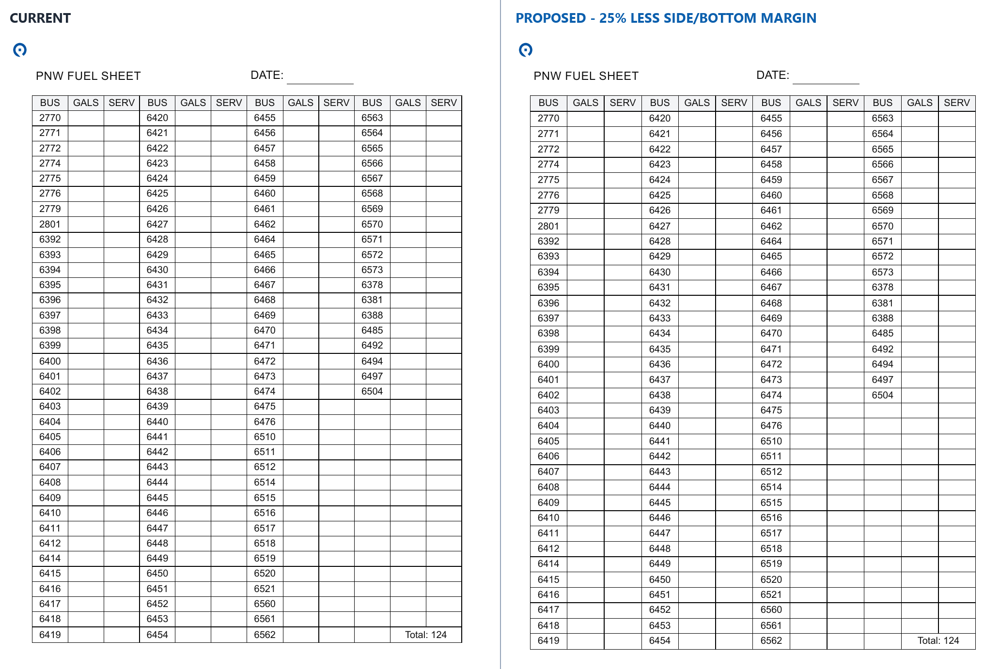
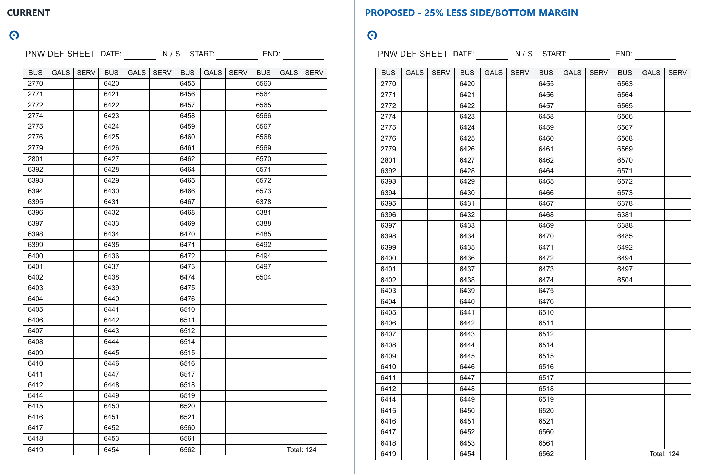
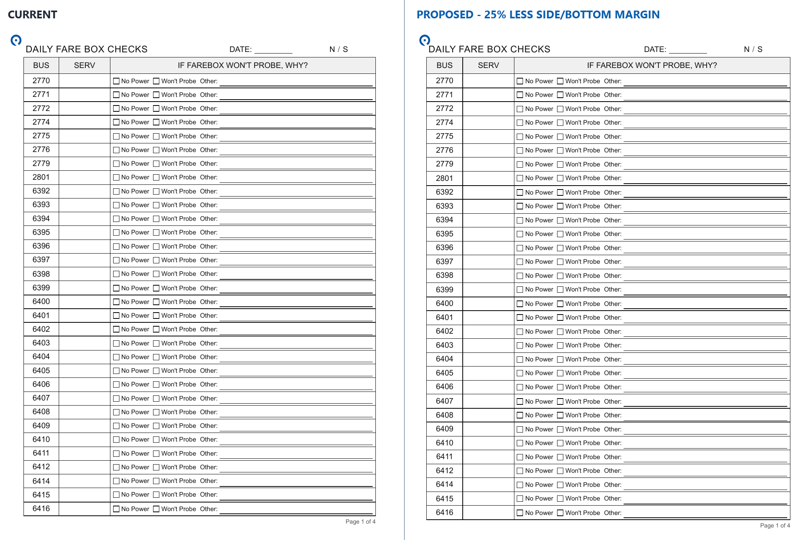

# Service Sheet Margin Preview

This review set compares the current production geometry with a proposed,
slightly larger sheet footprint. Nothing in this branch has been merged into
production.

## Proposed Change

- Fuel and DEF: keep the `0.5in` top margin; reduce left/right from `0.55in`
  to `0.4125in` and bottom from `0.45in` to `0.3375in`.
- Farebox: keep the `0.4in` top margin; reduce left/right from `0.5in` to
  `0.375in` and bottom from `0.32in` to `0.24in`.
- Text sizes, sheet content, paper size, and page counts are unchanged.

## Fuel

- [Current Fuel PDF](fuel-current.pdf)
- [Proposed Fuel PDF](fuel-proposed.pdf)

## DEF

- [Current DEF PDF](def-current.pdf)
- [Proposed DEF PDF](def-proposed.pdf)

## Farebox

- [Current Farebox PDF](farebox-current.pdf)
- [Proposed Farebox PDF](farebox-proposed.pdf)

## Geometry Check

- Fuel: 1 page, US Letter before and after.
- DEF: 1 page, US Letter before and after.
- Farebox: 4 pages, US Letter before and after.
